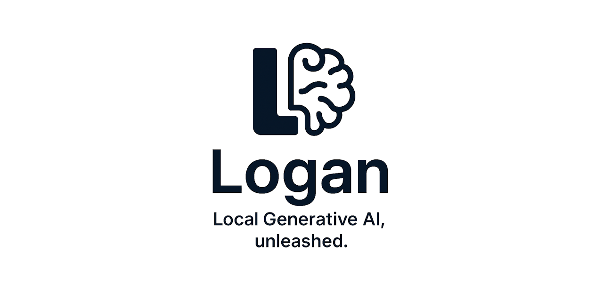

  

  

## 🚀 Logan - <u>Lo</u>cal <u>G</u>enerative <u>A</u>I, u<u>n</u>leashed.

Say goodbye to cloud lock‑in and opaque black‑box services—now you run state‑of‑the‑art generative AI models **entirely** on your own machine! 🎉  

- 🔒 **Privacy First:** Keep your data close to home—no more sending sensitive prompts or proprietary code off to third‑party servers.  
- ⚡ **Lightning‑Fast:** Enjoy sub‑second responses and rock‑solid performance with zero network latency.  
- 🔧 **Fully Customizable:** Fine‑tune architectures, tweak tokenizers, or swap out model weights to fit your unique workflow.  
- 🌐 **Offline‑Ready:** Perfect for air‑gapped environments, remote locations, or any place without reliable internet access.  
- 🛠 **Developer‑Friendly:** Preconfigured scripts, clear documentation, and seamless integration hooks make getting started a breeze.  

Whether you’re prototyping new ideas, building privacy‑sensitive applications, or simply exploring the cutting edge of AI, this toolkit puts you in the driver’s seat. Local Generative AI isn’t just unleashed—it’s **uuunleashed**! 🚀✨

## 🛠️ Support and Resources

- 🐞 **Report issues** via the [Issue Tracker](https://github.com/tinyBigGAMES/Logan/issues).
- 💬 **Engage in discussions** on the [Forum](https://github.com/tinyBigGAMES/Logan/discussions) and [Discord](https://discord.gg/tPWjMwK).
- 📚 **Learn more** at [Learn Delphi](https://learndelphi.org).

## 🤝 Contributing  

Contributions to **✨ Logan** are highly encouraged! 🌟  
- 🐛 **Report Issues:** Submit issues if you encounter bugs or need help.  
- 💡 **Suggest Features:** Share your ideas to make **Logan** even better.  
- 🔧 **Create Pull Requests:** Help expand the capabilities and robustness of the library.  

Your contributions make a difference! 🙌✨

#### Contributors 👥🤝
 

## 📜 Licensing

**Logan** is distributed under the **🆓 BSD-3-Clause License**, allowing for redistribution and use in both source and binary forms, with or without modification, under specific conditions.  
See the [📜 LICENSE](https://github.com/tinyBigGAMES/Logan?tab=BSD-3-Clause-1-ov-file#BSD-3-Clause-1-ov-file) file for more details.

---

🚀 Generative AI on your terms—run it locally for 🔒 privacy, ⚡ performance, and 🛠️ control!  

<h5 align="center">
  
Made with ❤️ in Delphi  
